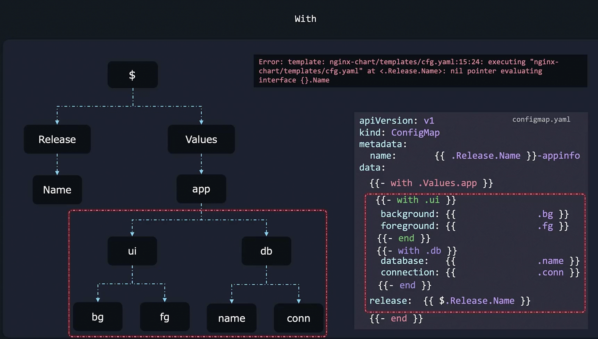

# Helm Objects

# Debugging Helm

# Purpose of using -
> Dash trims the white spaces which will appear in yaml

# If conditionals and operators

# Scopes

# With Block

> To access root scope inside with block use $

# Ranges

# Helpers tpl
> Used to write common code and add template

> We need to use include because to add spaces we need to add indent function and it only works with include not with template

