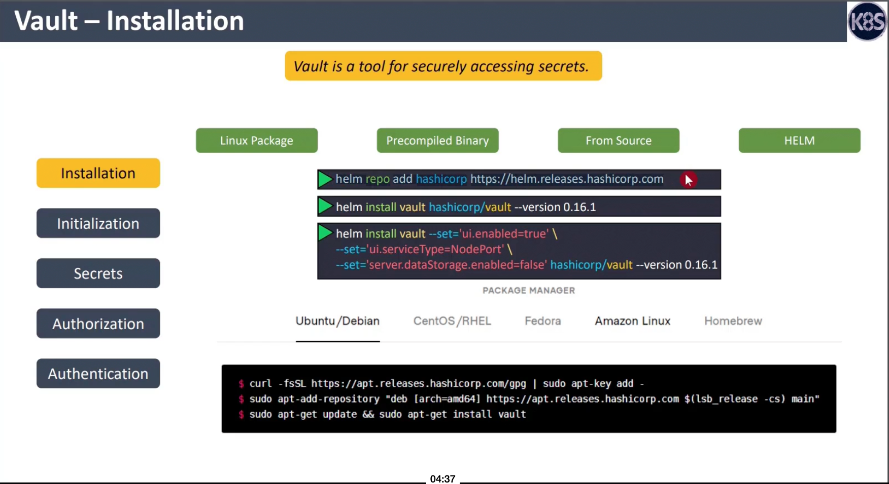
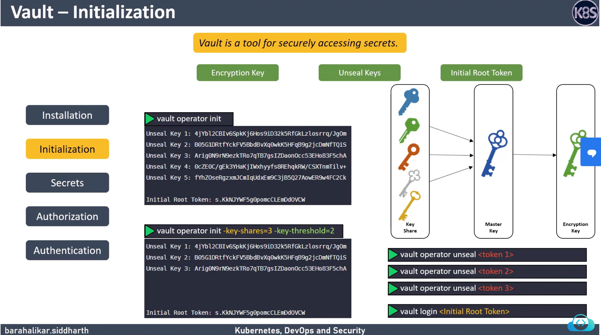
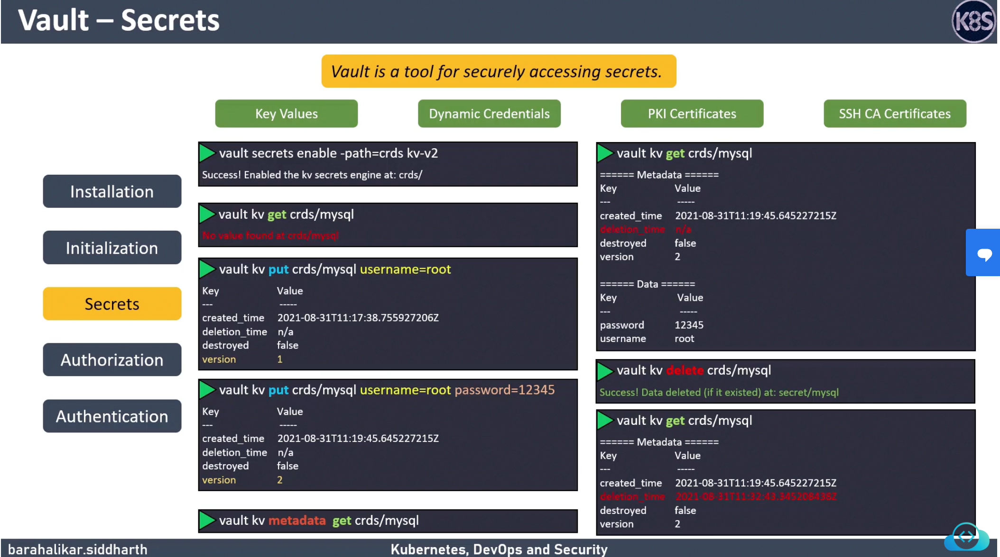
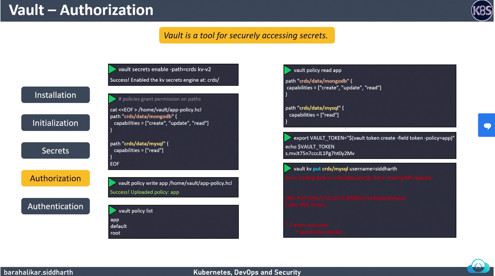
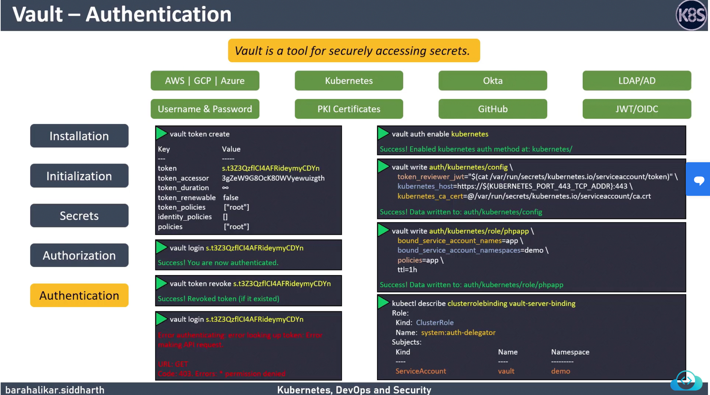
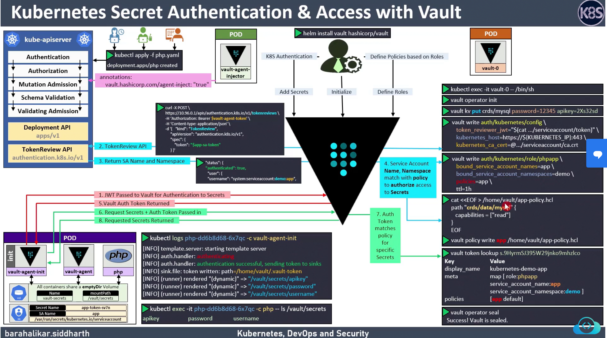

# Vault using helm

# Vault Installation


```shell
### Installation Commands
> helm repo add hashicorp https://helm.releases.hashicorp.com
> helm pull hashicorp/vault --untar
> k create ns vault
> helm install vault hashicorp/vault --set='ui.enabled=true' --set='ui.serviceType=NodePort' --set='server.dataStorage.enabled=false' hashicorp/vault 

### To check the status of vault
### You have to exec into the vault pod and check the status
> k exec -it vault-0 -- vault status

```

# Vault Initialization

```shell
### Initially when vault loads up it will be in sealed state we have to unseal it using operator init
> k exec -it vault-0 -- /bin/sh
> vault operator init (This is gonna provide 5keys)
### Use the below command to unseal vault for any of the 3keys provided above 
> vault operator unseal 
### To login vault
> vault login loginkey/root token
```

# Adding secrets to vault


```shell
> k exec -it vault-0 -- /bin/sh
> vault secrets enable -path=crds kv-v2
> vault kv get crds/mysql
> vault kv put crds/mysql username=root password=12345
> vault kv delete crds/mysql 
```

# Authorization


```shell
> k exec -it vault-0 -- /bin/sh
> vault secrets enable -path=crds kv-v2
```
```json
cat <<EOF > /home/vault/app-policy.hcl
path "crds/data/mongodb" {
capabilities = ["create", "update"]
}
path "crds/data/mysql" {
capabilities = ["read"]
}
EOF
```
```shell
> vault policy write app /home/vault/app-policy.hcl
> vault policy list
> vault policy read app

> export VAULT_TOKEN="$(vault token create -field token -policy=app)"

### The below command will not work because we have given only read permission on crds/mysql path so

> vault kv put crds/mysql username=root
> export VAULT_TOKEN=ORIGINALTOKEN after above doesnt work
```
# Authentication


```shell
> k exec -it vault-0 -- /bin/sh
> vault auth enable kubernetes
> vault write auth/kubernetes/config \
token_reviewer_jwt="$(cat /var/run/secrets/kubernetes.io/serviceaccount/token)" \
kubernetes_host=https://${KUBERNETES_PORT_443_TCP_ADDR}:443 \
kubernetes_ca_cert=@/var/run/secrets/kubernetes.io/serviceaccount/ca.crt
> vault write auth/kubernetes/role/phpapp \
bound_service_account_names=app \
bound_service_account_namespaces=vault \
policies=app \
ttl=1h
> exit
> kubectl describe clusterrolebinding vault-server-binding
```

# Annotations


```shell
### After adding the annotations to pod template. Agent injector injects an init container and a container to establish a communication to vault which will help in fetching secrets
```

# How it works internally

