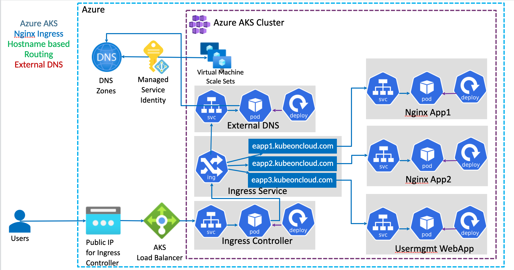

# Ingress Basic





----------------------------------------

# Ingress - Basics (Create Static Public IP in Azure dedicated for Ingress)

## Step-01: Introduction
### Ingress Basic Architecture


### What are we going to learn?
- We are going to create a **Static Public IP** for Ingress in Azure AKS
- Associate that Public IP to **Ingress Controller** during installation.
- We are going to create a namespace `ingress-nginx` for Ingress Controller where all ingress controller related things will be placed. 
- In future, we install **cert-manager** for SSL certificates also in same namespace. 
- **Caution Note:** This namespace is for Ingress controller stuff, ingress resource we can create in any other namespaces and not an issue.  Only condition is create ingress resource and ingress pointed application in same namespace (Example: App1 and Ingress resource of App1 should be in same namespace)
- Create / Review Ingress Manifest
- Deploy a simple Nginx App1 with Ingress manifest and test it
- Clean-Up or delete application after testing


## Step-02: Create Static Public IP
```t
# Get the resource group name of the AKS cluster 
az aks show --resource-group sarthak-cluste_group --name devops-aks-tools --query nodeResourceGroup -o tsv

# TEMPLATE - Create a public IP address with the static allocation
az network public-ip create --resource-group <REPLACE-OUTPUT-RG-FROM-PREVIOUS-COMMAND> --name myAKSPublicIPForIngress --sku Standard --allocation-method static --query publicIp.ipAddress -o tsv

# REPLACE - Create Public IP: Replace Resource Group value
az network public-ip create --resource-group MC_sarthak-cluste_group_devops-aks-tools_eastus --name myAKSPublicIPForIngress --sku Standard --allocation-method static --query publicIp.ipAddress -o tsv
```
- Make a note of Static IP which we will use in next step when installing Ingress Controller
```t
# Make a note of Public IP created for Ingress
20.169.187.220
```

## Step-03: Install Ingress Controller
```t
# Install Helm3 (if not installed)
brew install helm

# Create a namespace for your ingress resources
kubectl create namespace ingress-nginx

# Add the official stable repository
helm repo add ingress-nginx https://kubernetes.github.io/ingress-nginx
helm repo update

#  Customizing the Chart Before Installing. 
helm show values ingress-nginx/ingress-nginx

# Use Helm to deploy an NGINX ingress controller
helm install ingress-nginx /ingress-nginx \
    --namespace ingress-nginx \
    --set controller.replicaCount=1 \
    --set controller.nodeSelector."kubernetes\.io/os"=linux \
    --set defaultBackend.nodeSelector."kubernetes\.io/os"=linux \
    --set controller.service.externalTrafficPolicy=Local \
    --set controller.service.loadBalancerIP="REPLACE_STATIC_IP" 

# Replace Static IP captured in Step-02 (without beta for NodeSelectors)
helm install ingress-nginx /ingress-nginx \
    --namespace ingress-nginx \
    --set controller.replicaCount=2 \
    --set controller.nodeSelector."kubernetes\.io/os"=linux \
    --set defaultBackend.nodeSelector."kubernetes\.io/os"=linux \
    --set controller.service.externalTrafficPolicy=Local \
    --set controller.service.loadBalancerIP="20.169.187.220"    
```

# List Services with labels
kubectl get service -l app.kubernetes.io/name=ingress-nginx --namespace ingress-nginx

# List Pods
kubectl get pods -n ingress-nginx
kubectl get all -n ingress-nginx


# Access Public IP
http://<Public-IP-created-for-Ingress>

# Output should be
404 Not Found from Nginx

# Verify Load Balancer on Azure Mgmt Console
Primarily refer Settings -> Frontend IP Configuration
```

## Step-04: Review Application k8s manifests
- 01-NginxApp1-Deployment.yml
- 02-NginxApp1-ClusterIP-Service.yml
- 03-Ingress-Basic.yml

## Step-05: Deploy Application k8s manifests and verify
```t
# Deploy
kubectl apply -f kube-manifests/

# List Pods
kubectl get pods

# List Services
kubectl get svc

# List Ingress
kubectl get ingress

# Access Application
http://<Public-IP-created-for-Ingress>/app1/index.html
http://<Public-IP-created-for-Ingress>

# Verify Ingress Controller Logs
kubectl get pods -n ingress-basic
kubectl logs -f <pod-name> -n ingress-basic
```

## Step-06: Clean-Up Apps
```t
# Delete Apps
kubectl delete -f kube-manifests/
```

## Ingress Annotation Reference
- https://kubernetes.github.io/ingress-nginx/user-guide/nginx-configuration/annotations/

## Other References
- https://github.com/kubernetes/ingress-nginx
- https://github.com/kubernetes/ingress-nginx/blob/master/charts/ingress-nginx/values.yaml
- https://raw.githubusercontent.com/kubernetes/ingress-nginx/controller-v0.34.1/deploy/static/provider/cloud/deploy.yaml
- https://kubernetes.github.io/ingress-nginx/deploy/#azure
- https://helm.sh/docs/intro/install/
- https://kubernetes.io/docs/reference/generated/kubernetes-api/v1.19/#ingress-v1-networking-k8s-io
- [Kubernetes Ingress API Reference](https://kubernetes.io/docs/reference/generated/kubernetes-api/v1.24/#ingress-v1-networking-k8s-io)
- [Ingress Path Types](https://kubernetes.io/docs/concepts/services-networking/ingress/#path-types)

## Important Note
```
Ingress Admission Webhooks
With nginx-ingress-controller version 0.25+, the nginx ingress controller pod exposes an endpoint that will integrate with the validatingwebhookconfiguration Kubernetes feature to prevent bad ingress from being added to the cluster. This feature is enabled by default since 0.31.0.
```

----------------

# Ingress - Context Path Based Routing

## Step-01: Introduction
- We are going to implement context path based routing using Ingress


## Step-02: Review k8s Application Manifests
- 01-NginxApp1-Manifests
- 02-NginxApp2-Manifests
- 03-UserMgmtmWebApp-Manifests

## Step-03: Review Ingress Service Manifests
- 04-IngressService-Manifests


### Using default backend

```yaml
apiVersion: networking.k8s.io/v1
kind: Ingress
metadata:
  name: ingress-cpr
  annotations:
    kubernetes.io/ingress.class: nginx  
spec:
  defaultBackend:
    service:
      name: usermgmt-webapp-clusterip-service
      port:
        number: 80
  rules:
    - http:
        paths:
          - path: /app1
            pathType: Prefix
            backend:
              service:
                name: app1-nginx-clusterip-service
                port: 
                  number: 80
          - path: /app2
            pathType: Prefix
            backend:
              service:
                name: app2-nginx-clusterip-service
                port: 
                  number: 80  
```
## Step-04: Deploy and Verify
```t
# Deploy Apps
kubectl apply -R -f kube-manifests/

# List Pods
kubectl get pods

# List Services
kubectl get svc

# List Ingress
kubectl get ingress

# Verify Ingress Controller Logs
kubectl get pods -n ingress-basic
kubectl logs -f <pod-name> -n ingress-basic
```

## Step-05: Access Applications
```t
# Access App1
http://<Public-IP-created-for-Ingress>/app1/index.html

# Access App2
http://<Public-IP-created-for-Ingress>/app2/index.html

# Access Usermgmt Web App
http://<Public-IP-created-for-Ingress>
Username: admin101
Password: password101
```

## Step-06: Clean-Up Applications
```t
# Delete Apps
kubectl delete -f kube-manifests/

# Delete Azure Disk created for Usermgmt Web App
Go to All Services -> Azure Disks -> Delete disk
```

## Ingress Annotation Reference
- https://kubernetes.github.io/ingress-nginx/user-guide/nginx-configuration/annotations/
- [Ingress Path Types](https://kubernetes.io/docs/concepts/services-networking/ingress/#path-types)

--------------
# Domain Register


# Delegate Domain to Azure DNS

## Step-01: Introduction
- Understand about
  - Domain Registrar
  - DNS Zones
- Learn to delegate a domain from AWS Route53 to Azure DNS by creating DNS Zones in Azure Cloud 


## Step-02: DNS Zones - Create DNS Zone
- Go to Service -> **DNS Zones**
- **Subscription:** sarsatis@publicisgroupe.net (You need to have a paid subscription for this)
- **Resource Group:** sarthak-cluste-group
- **Name:** simplifydevopstools.com
- **Resource Group Location:** East US
- Click on **Review + Create**

## Step-03: Make a note of Azure Nameservers
- Go to Services -> **DNS Zones** -> **simplifydevopstools.com**
- Make a note of Nameservers
```
ns1-04.azure-dns.com.
ns2-04.azure-dns.net.
ns3-04.azure-dns.org.
ns4-04.azure-dns.info.
```

## Step-04: Update Nameservers at your Domain provider (Mine is AWS)
- **Verify before updation**
```
nslookup -type=SOA simplifydevopstools.com
nslookup -type=NS simplifydevopstools.com
```
- Go to AWS Route53 (This is my Domain Provider)
- Go to Services -> Route53 -> Registered Domains -> simplifydevopstools.com
- Click on **Add or edit name servers**
- Update Azure Name servers here and click on **Update**
- Click on **Hosted Zones**
- Delete the hosted zone with name **kubeoncloud.com**
- **Verify after updation**
```
nslookup -type=SOA simplifydevopstools.com 8.8.8.8
nslookup -type=NS simplifydevopstools.com 8.8.8.8
```

-------------


