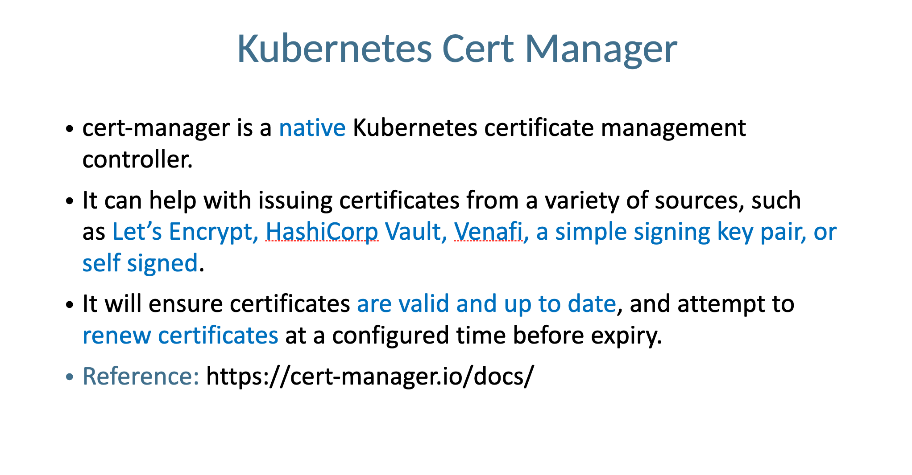
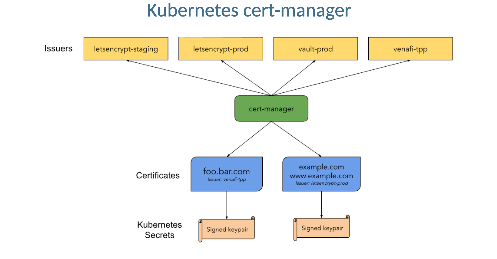
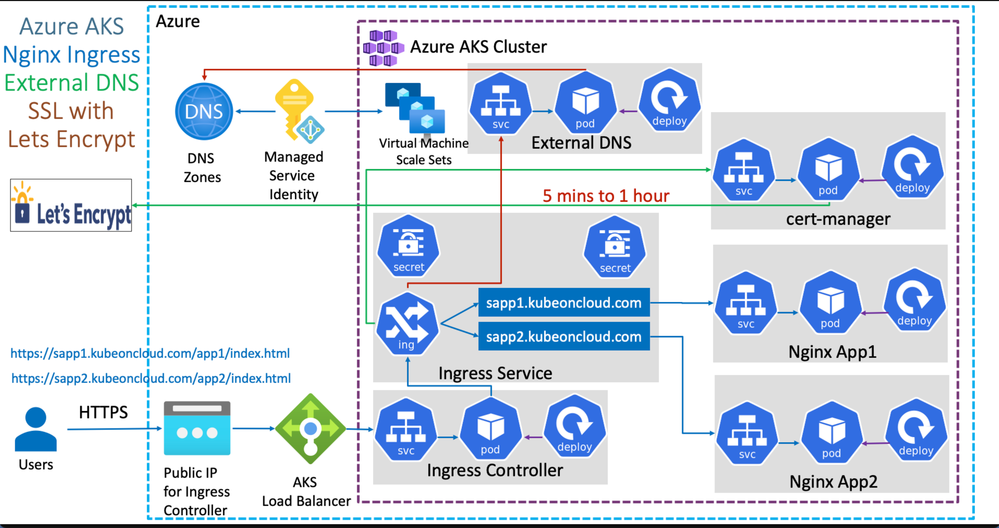
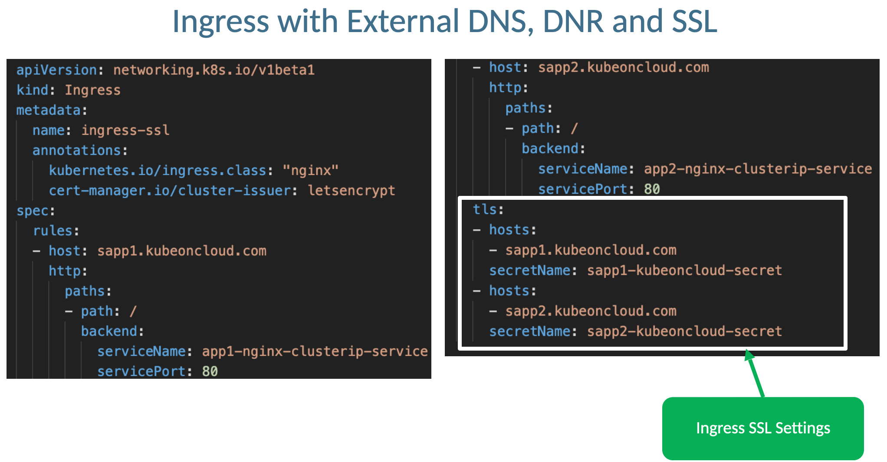

# Ingress - SSL

## Step-01: Introduction
- Implement SSL using Lets Encrypt



## Step-02: Install Cert Manager
```t
# Create NS
kubectl create ns cert-manager

# Label the cert-manager namespace to disable resource validation
kubectl label namespace cert-manager cert-manager.io/disable-validation=true

# Add the Jetstack Helm repository
helm repo add jetstack https://charts.jetstack.io

# Update your local Helm chart repository cache
helm repo update

# Install the cert-manager Helm chart
helm install \
  cert-manager jetstack/cert-manager \
  --namespace cert-manager \
  --set installCRDs=true

## SAMPLE OUTPUT
$ helm install \                                             
  cert-manager jetstack/cert-manager \
  --namespace cert-manager \
  --set installCRDs=true
NAME: cert-manager
LAST DEPLOYED: Thu Apr 13 13:53:40 2023
NAMESPACE: cert-manager
STATUS: deployed
REVISION: 1
TEST SUITE: None
NOTES:
cert-manager v1.11.1 has been deployed successfully!

In order to begin issuing certificates, you will need to set up a ClusterIssuer
or Issuer resource (for example, by creating a 'letsencrypt-staging' issuer).

More information on the different types of issuers and how to configure them
can be found in our documentation:

https://cert-manager.io/docs/configuration/

For information on how to configure cert-manager to automatically provision
Certificates for Ingress resources, take a look at the `ingress-shim`
documentation:

https://cert-manager.io/docs/usage/ingress/


# Verify Cert Manager pods
kubectl get pods --namespace cert-manager

# Verify Cert Manager Services
kubectl get svc --namespace cert-manager
```

## Step-06: Review or Create Cluster Issuer Kubernetes Manifest
### Review Cluster Issuer Kubernetes Manifest
- Create or Review Cert Manager Cluster Issuer Kubernetes Manigest
```yaml
apiVersion: cert-manager.io/v1
kind: ClusterIssuer
metadata:
  name: letsencrypt
spec:
  acme:
    # The ACME server URL
    server: https://acme-v02.api.letsencrypt.org/directory
    # Email address used for ACME registration
    email: sarthaks5493@gmail.com
    # Name of a secret used to store the ACME account private key
    privateKeySecretRef:
      name: letsencrypt
    solvers:
      - http01:
          ingress:
            class: nginx
```

### Deploy Cluster Issuer
```t
# Deploy Cluster Issuer
kubectl apply -f 6.cert-manager/cluster-issuer.yaml

# List Cluster Issuer
kubectl get clusterissuer

# Describe Cluster Issuer
kubectl describe clusterissuer letsencrypt
```


## Step-07: Review Application Ingress Manifests



- domain-based-ssl/jenkins-ingress.yaml
- domain-based-ssl/vault-ingress.yaml

## Step-09: Deploy All Manifests & Verify
- Certificate Request, Generation, Approal and Download and be ready might take from 1 hour to couple of days if we make any mistakes and also fail.
- For me it took, only 5 minutes to get the certificate from **https://letsencrypt.org/**
```t
# Deploy
kubectl apply -R -f 6.cert-manager/domain-based-ssl/

# Verify Pods
kubectl get pods

# Verify Cert Manager Pod Logs
kubectl get pods -n cert-manager
kubectl  logs -f <cert-manager-55d65894c7-sx62f> -n cert-manager #Replace Pod name

# Verify SSL Certificates (It should turn to True)
$ k get certificate -A
NAMESPACE   NAME                                 READY   SECRET                               AGE
jenkins     jenkins.simplifydevopstools-secret   True    jenkins.simplifydevopstools-secret   22m
vault       vault.simplifydevopstools-secret     True    vault.simplifydevopstools-secret     22m


## Step-10: Access Application
```t
# URLs
http://jenkins.simplifydevopstools.com/
http://vault.simplifydevopstools.com/
```

## Cert Manager
- https://cert-manager.io/docs/installation/#default-static-install
- https://cert-manager.io/docs/installation/helm/
- https://docs.cert-manager.io/
- https://cert-manager.io/docs/installation/helm/#1-add-the-jetstack-helm-repository
- https://cert-manager.io/docs/configuration/
- https://cert-manager.io/docs/tutorials/acme/nginx-ingress/#step-6---configure-a-lets-encrypt-issuer
- https://letsencrypt.org/how-it-works/

  
  
