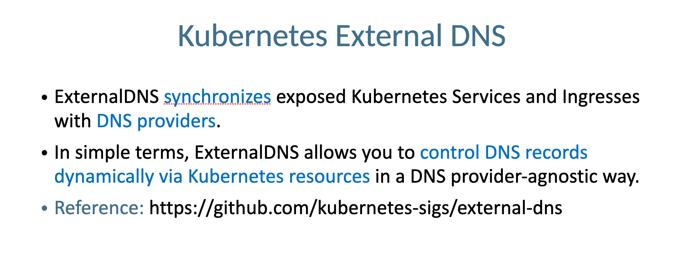
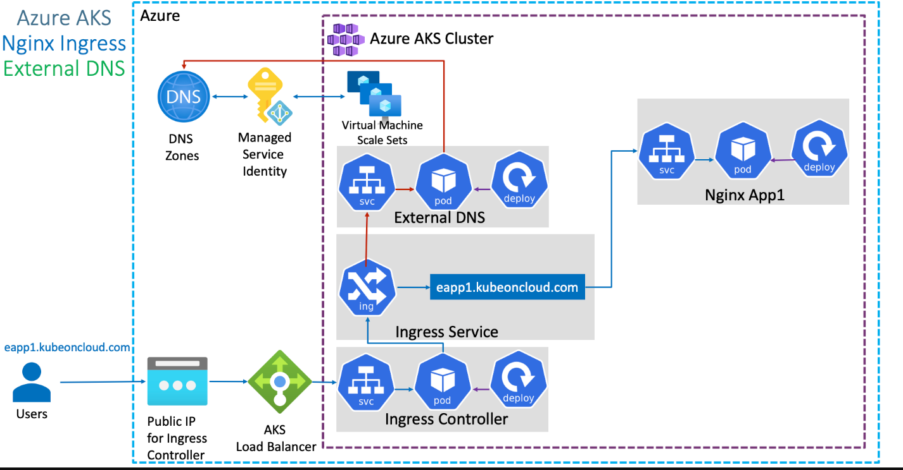

# Kubernetes ExternalDNS to create Record Sets in Azure DNS from AKS



## Step-01: Introduction
- Create External DNS Manifest
- Provide Access to DNZ Zones using **Azure Managed Service Identity** for External DNS pod to create **Record Sets** in Azure DNS Zones
- Review Application & Ingress Manifests
- Deploy and Test


## Step-02: Create External DNS Manifests
- External-DNS needs permissions to Azure DNS to modify (Add, Update, Delete DNS Record Sets)
- We can provide permissions to External-DNS pod in two ways in Azure 
  - Using Azure Service Principal
  - Using Azure Managed Service Identity (MSI)
- We are going to use `MSI` for providing necessary permissions here which is latest and greatest in Azure as on today. 


### Gather Information Required for azure.json file
```t
# To get Azure Tenant ID
az account show --query "tenantId"

# To get Azure Subscription ID
az account show --query "id"
```

### Create azure.json file
```json
{
  "tenantId": "d52c9ea1-7c21-47b1-82a3-33a74b1f74b8",
  "subscriptionId": "3ec3acee-ef93-4cb4-a3eb-4304bc552319",
  "resourceGroup": "sarthak-cluste_group", 
  "useManagedIdentityExtension": true,
  "userAssignedIdentityID": "cb5ab802-a9cf-43e8-9c3f-663a80bd4db8"  
}
```

### Review external-dns.yml manifest
```yaml
apiVersion: v1
kind: ServiceAccount
metadata:
  name: external-dns
---
apiVersion: rbac.authorization.k8s.io/v1
kind: ClusterRole
metadata:
  name: external-dns
rules:
- apiGroups: [""]
  resources: ["services","endpoints","pods", "nodes"]
  verbs: ["get","watch","list"]
- apiGroups: ["extensions","networking.k8s.io"]
  resources: ["ingresses"] 
  verbs: ["get","watch","list"]
- apiGroups: [""]
  resources: ["nodes"]
  verbs: ["list"]
---
apiVersion: rbac.authorization.k8s.io/v1
kind: ClusterRoleBinding
metadata:
  name: external-dns-viewer
roleRef:
  apiGroup: rbac.authorization.k8s.io
  kind: ClusterRole
  name: external-dns
subjects:
- kind: ServiceAccount
  name: external-dns
  namespace: default
---
apiVersion: apps/v1
kind: Deployment
metadata:
  name: external-dns
spec:
  strategy:
    type: Recreate
  selector:
    matchLabels:
      app: external-dns
  template:
    metadata:
      labels:
        app: external-dns
    spec:
      serviceAccountName: external-dns
      containers:
      - name: external-dns
        image: k8s.gcr.io/external-dns/external-dns:v0.11.0
        args:
        - --source=service
        - --source=ingress
        #- --domain-filter=example.com # (optional) limit to only example.com domains; change to match the zone created above.
        - --provider=azure
        #- --azure-resource-group=externaldns # (optional) use the DNS zones from the specific resource group
        volumeMounts:
        - name: azure-config-file
          mountPath: /etc/kubernetes
          readOnly: true
      volumes:
      - name: azure-config-file
        secret:
          secretName: azure-config-file
```

## Step-03: Create MSI - Managed Service Identity for External DNS to access Azure DNS Zones

### Create Manged Service Identity (MSI)
- Go to All Services -> Managed Identities -> Add
- Resource Name: externaldns-access-to-dnszones
- Subscription: Pay-as-you-go
- Resource group: MC_sarthak-cluste_group_devops-aks-tools_eastus (It should be same as where cluster is deployed)
- Location: East US
- Click on **Create**

### Add Azure Role Assignment in MSI
- Opem MSI -> externaldns-access-to-dnszones
- Click on **Azure Role Assignments** -> **Add role assignment**
- Scope: Resource group
- Subscription: sarsatis@publicisgroupe.net
- Resource group: MC_sarthak-cluste_group_devops-aks-tools_eastus
- Role: Contributor

### Make a note of Client Id and update in azure.json
- Go to **Overview** -> Make a note of **Client ID"
- Update in **azure.json** value for **userAssignedIdentityID**
```
  "userAssignedIdentityID": "cb5ab802-a9cf-43e8-9c3f-663a80bd4db8"
```

## Step-04: Associate MSI in AKS Cluster VMSS
- Go to All Services -> Virtual Machine Scale Sets (VMSS) -> Open aksdemo1 related VMSS (aks-agentpool-27193923-vmss)
- Go to Settings -> Identity -> User assigned -> Add -> externaldns-access-to-dnszones 


## Step-05: Create Kubernetes Secret and Deploy ExternalDNS
```t
# Create Secret
cd kube-manifests/01-ExteranlDNS
kubectl create secret generic azure-config-file --from-file=azure.json

# List Secrets
kubectl get secrets

# Deploy ExternalDNS 
cd kube-manifests/01-ExteranlDNS
kubectl apply -f external-dns.yml

# Verify ExternalDNS Logs
kubectl logs -f $(kubectl get po | egrep -o 'external-dns[A-Za-z0-9-]+')
```

```log
# Error Type: 400
time="2020-08-24T11:25:04Z" level=error msg="azure.BearerAuthorizer#WithAuthorization: Failed to refresh the Token for request to https://management.azure.com/subscriptions/82808767-144c-4c66-a320-b30791668b0a/resourceGroups/dns-zones/providers/Microsoft.Network/dnsZones?api-version=2018-05-01: StatusCode=400 -- Original Error: adal: Refresh request failed. Status Code = '400'. Response body: {\"error\":\"invalid_request\",\"error_description\":\"Identity not found\"}"

# Error Type: 403
Notes: Error 403 will come when our Managed Service Identity dont have access to respective destination resource 

# When all good, we should get log as below
time="2020-08-24T11:27:59Z" level=info msg="Resolving to user assigned identity, client id is 404b0cc1-ba04-4933-bcea-7d002d184436."
```


## Step-06: Deploy Application and Test
- When dns record set got created in DNS Zone, the log in external-dns should look as below.

### Deploy Application
```t
# Deploy Application
kubectl apply -f kube-manifests/02-NginxApp1

# Verify Pods and Services
kubectl get po,svc

# Verify Ingress
kubectl get ingress
```

### Verify logs in External DNS Pod
- Wait for 3 to 5 minutes for Record Set update in DNZ Zones
```t
# Verify ExternalDNS Logs
kubectl logs -f $(kubectl get po | egrep -o 'external-dns[A-Za-z0-9-]+')
```
- External DNS Pod Logs
```log
time="2023-04-12T21:34:22Z" level=info msg="Updating A record named 'vault' to '20.169.187.220' for Azure DNS zone 'simplifydevopstools.com'."
time="2023-04-12T21:34:22Z" level=info msg="Updating TXT record named 'vault' to '\"heritage=external-dns,external-dns/owner=default,external-dns/resource=ingress/vault/vault\"' for Azure DNS zone 'simplifydevopstools.com'."
```

### Verify Record Set in DNS Zones -> kubeoncloud.com
- Go to All Services -> DNS Zones -> kubeoncloud.com
- Verify if we have `vault.simplifydevopstools.com` created
```t
# Template Command
az network dns record-set a list -g <Resource-Group-dnz-zones> -z <yourdomain.com>

# Replace DNS Zones Resource Group and yourdomain
az network dns record-set a list -g dns-zones -z kubeoncloud.com
```
- Perform `nslookup` test
```t
# nslookup Test
Kalyans-MacBook-Pro:01-ExternalDNS kdaida$ nslookup simplifydevopstools.com
Server:         192.168.0.1
Address:        192.168.0.1#53

Non-authoritative answer:
Name:   vault.simplifydevopstools.com
Address: 20.169.187.220

Kalyans-MacBook-Pro:01-ExternalDNS kdaida$ 
```

### Access Application and Test
```t
# Access Application
http://vault.simplifydevopstools.com/ui/


# Note: Replace simplifydevopstools.com with your domain name
```

## References
- https://github.com/kubernetes-sigs/external-dns/blob/master/docs/tutorials/azure.md
- Open Issue and Break fix: https://github.com/kubernetes-sigs/external-dns/issues/1548
- https://github.com/kubernetes/ingress-nginx/tree/master/charts/ingress-nginx#configuration
- https://github.com/kubernetes/ingress-nginx/blob/master/charts/ingress-nginx/values.yaml
- https://kubernetes.github.io/ingress-nginx/

## External DNS References
- https://github.com/kubernetes-sigs/external-dns
- https://github.com/kubernetes-sigs/external-dns/blob/master/docs/faq.md