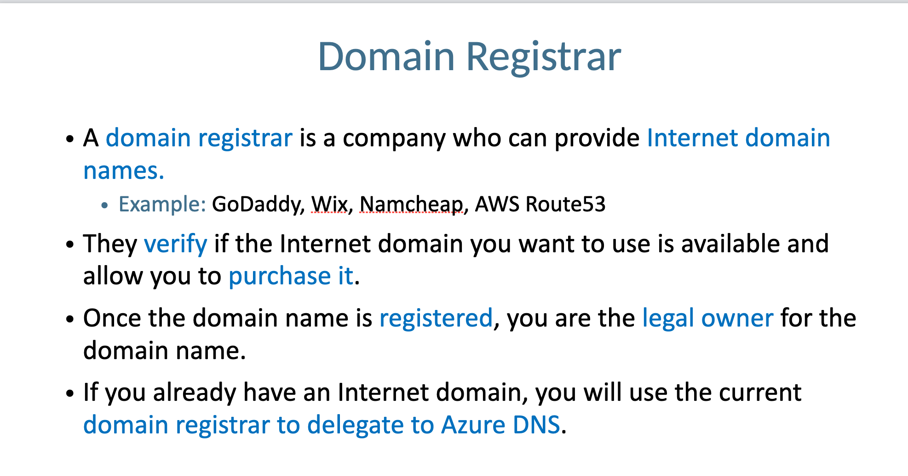
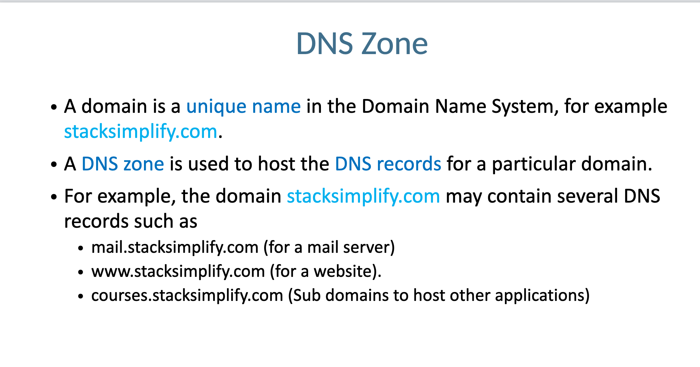
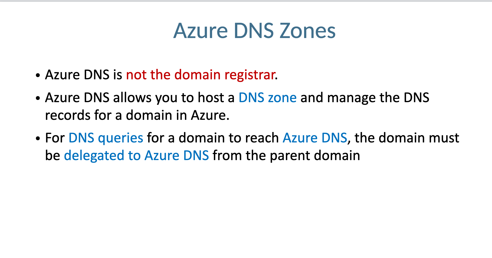
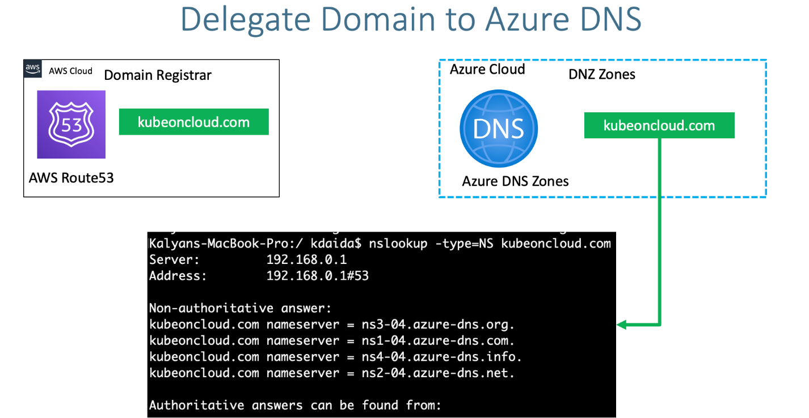

# Domain Register







# Delegate Domain to Azure DNS

## Step-01: Introduction
- Understand about
  - Domain Registrar
  - DNS Zones
- Learn to delegate a domain from AWS Route53 to Azure DNS by creating DNS Zones in Azure Cloud 




## Step-02: DNS Zones - Create DNS Zone
- Go to Service -> **DNS Zones**
- **Subscription:** sarsatis@publicisgroupe.net (You need to have a paid subscription for this)
- **Resource Group:** sarthak-cluste-group
- **Name:** simplifydevopstools.com
- **Resource Group Location:** East US
- Click on **Review + Create**

## Step-03: Make a note of Azure Nameservers
- Go to Services -> **DNS Zones** -> **simplifydevopstools.com**
- Make a note of Nameservers
```
ns1-04.azure-dns.com.
ns2-04.azure-dns.net.
ns3-04.azure-dns.org.
ns4-04.azure-dns.info.
```

## Step-04: Update Nameservers at your Domain provider (Mine is AWS)
- **Verify before updation**
```
nslookup -type=SOA simplifydevopstools.com
nslookup -type=NS simplifydevopstools.com
```
- Go to AWS Route53 (This is my Domain Provider)
- Go to Services -> Route53 -> Registered Domains -> simplifydevopstools.com
- Click on **Add or edit name servers**
- Update Azure Name servers here and click on **Update**
- Click on **Hosted Zones**
- Delete the hosted zone with name **kubeoncloud.com**
- **Verify after updation**
```
nslookup -type=SOA simplifydevopstools.com 8.8.8.8
nslookup -type=NS simplifydevopstools.com 8.8.8.8
```